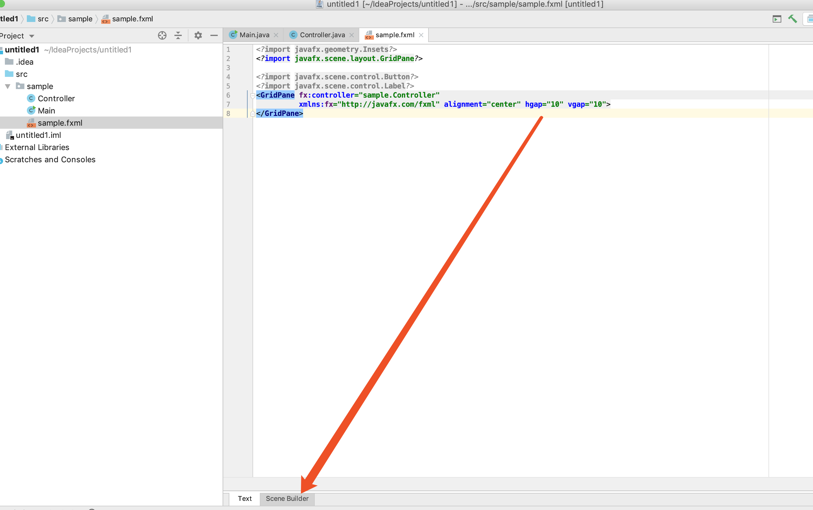
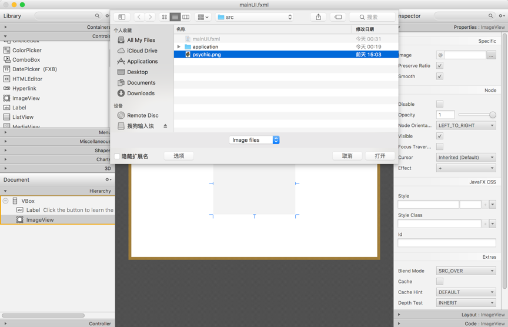

# JavaFX Sample Tutotial
This tutorial is based on the jdk8, if your java version is higher than 8, using internet to solve it.

------

 # If you are using Eclipse as your IDE:

## How to install e(fx)eclipse and Scene Builder 
   This part will introduce how to develop and run JavaFX programe on Eclipse IDE.
   To start the journal, it is neccessriy to set up the environment and tools for helping us programe on Eclipse. 

### e(fx)eclipse
The Eclipse e(fx)clipse project provides tooling and runtime components that help developers create JavaFX applications. e(fx)eclipse is a set of tools and necessary library. It is going to help you execute JavaFX program, so you need to make sure that you have already download it and installed successfully on your eclipse. If you haven't installed e(fx)eclipse yet, I hope the tutorial below will do you a favor:

   Chinese:http://www.yiibai.com/javafx/install-efxclipse-into-eclipse.html
   
   English:http://wiki.eclipse.org/Efxclipse/Tutorials/AddingE(fx)clipse_to_eclipse#Installing_e.28fx.29clipse_IDE.

### JavaFX Scene Builder
   JavaFX Scene Builder is a visual layout tool that lets users quickly design JavaFX application user interfaces, without coding. Users can drag and drop UI components to a work area, modify their properties, apply style sheets, and the FXML code for the layout that they are creating is automatically generated in the background. The result is an FXML file that can then be combined with a Java project by binding the UI to the application’s logic. 
   
Chinese:http://www.yiibai.com/javafx/install-javafx-scene-builder-into-eclipse.html

English:https://o7planning.org/en/10621/install-javafx-scene-builder-into-eclipse

--------

# If you are using Intellij IEDA as your IDE:

You only need to download JavaFx Scene Builder and javafx plugin.

English:https://www.jetbrains.com/help/idea/preparing-for-javafx-application-development.html

Chinese:https://blog.csdn.net/hst_gogogo/article/details/82530929

-------

# 1. Create Project

Open Eclipse, Select:
- File -> New -> Project

- Select JavaFX Project

- Named your project

After all, your project structure will look like:

Then, let us make sure that JAVA2LAB3Demo excute successfully, right click on the main class (Main) and select:
- Run As -> Java Application
 
- JAVA2Lab3Demo application is running, and the result is blank  as follows:
- 
------
For Intellij IEDA
- File -> New -> Project

- Select JAVAFX on the left

- Next -> type name -> Finish

# 2. JAVA2Lab3Demo example description
In the above steps, JAVA2Lab3Demo application have successfully been created and run .

In general, a JavaFX application will have three major components namely Stage, Scene and Container, Layouts and Controls as shown in the following diagram.

For details:https://www.tutorialspoint.com/javafx/javafx_application.htm

# 3. Using JavaFX Scene Builder Demo
This is a small example of using Scene Builder to design an application interface. The model of MVC applied to this example is as follows:

- Display on VIEW
- User use CONTROLLER
- operate data(Create, update, delete,..) on Model
- Display data from MODEL on VIEW

Next step, we are going to create a new mainUI.xml file.
- File -> New -> Other…

- Type the name of file: "mainUI" or other name.(Root element should be VBox)

- the result should be below:

we can use JAVAFX Scene Builder to open fxml format file.

if you use IDEA:

- mainUI.fxml design should look like:

- Set the properties of the VBox

- Drag and drop a label into the VBox 

- Set its Text to the text to display (For example: "Click the button to learn the meaning of life")
- Continue to set the font and text color 

- Drag and drop a ImageView into the VBox

- click "..." select a photo

- Drag and drop a Button into the VBox

- Set it's Text to the the to display(For example:"Click to Learn")

- Continue to set the font and text color

- set method "moveWindow", call when mouse entered

- Select "File" -> "Save" 
- Select "Preview" -> "Show Preview in Window" to preview your design

- After all, your design should be:

- Close JAVAFX Scene Builder and refresh project on eclipse, you can view your code in mainUI.fxml

- Add the property fx:controller to <VBox>, which will have a reference to a control inside the VBox (such as myButton).

- At this point, we create a new class in the application package, named MainUIxml, remember that the name of this class should be the same as the one set in fxml.

- MainUIxml.java:

- Main.java

# Advanced
For people whose jdk version are higher than 8.
## JavaFX in Java 9
JavaFX did not get a lot of new features in Java 9, but it did get 750+ bug fixes, so if you are planning to build a new JavaFX app from scratch, you might want to consider starting with Java 9 !

## JavaFX From Java 11
From Java 11, JavaFX has been removed from the Java SDK again. JavaFX has been detached into its own open source project. This means that to download JavaFX from Java 11 / JavaFX 11, you have to go to:

http://openjfx.io

# Reference:

http://www.yiibai.com/javafx/install-efxclipse-into-eclipse.html

http://wiki.eclipse.org/Efxclipse/Tutorials/AddingE(fx)clipse_to_eclipse#Installing_e.28fx.29clipse_IDE.

https://www.jetbrains.com/help/idea/preparing-for-javafx-application-development.html

https://blog.csdn.net/hst_gogogo/article/details/82530929

http://openjfx.io
