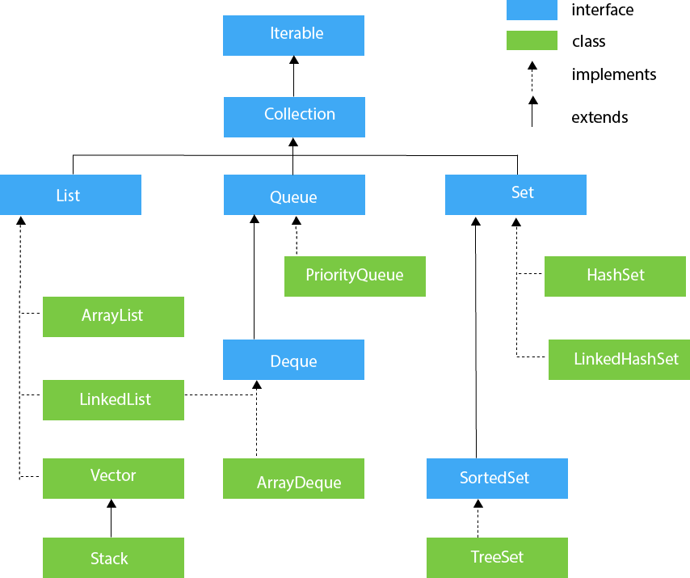

# Collections in Java
The Collection in Java is a framework that provides an architecture to store and manipulate the group of objects.

Java Collections can achieve all the operations that you perform on a data such as searching, sorting, insertion, manipulation, and deletion.

Java Collection means a single unit of objects. Java Collection framework provides many interfaces (Set, List, Queue, Deque) and classes (ArrayList, Vector, LinkedList, PriorityQueue, HashSet, LinkedHashSet, TreeSet).

## Hierarchy of Collection Framework


## List Interface
List interface is the child interface of Collection interface. It inhibits a list type data structure in which we can store the ordered collection of objects. It can have duplicate values.

List interface is implemented by the classes ArrayList, LinkedList, Vector, and Stack.
```java
import java.util.*;

public class DemoCollection {

    public static void main(String args[]){
        List<String> list=new ArrayList<String>();//Creating arraylist
        //List<String> list=new LinkedList<String>();//Creating linkedlist
        //List<String> list=new Vector<String>();//Creating vector
        //List<String> list=new Stack<String>();//Creating stack

        list.add("Ravi");//Adding object in arraylist
        list.add("Vijay");
        list.add("Ravi");
        list.add("Ravi");
        list.add("Ajay");
        // method 1
        // Traversing list through Iterator
        Iterator itr=list.iterator();
        while(itr.hasNext()) {
            System.out.println(itr.next());
        }
        System.out.println("--------");
        list.remove("Ravi");// remove object Ravi but only remove first one

        // method 2
        for (String element:list){
            System.out.println(element);
        }
        System.out.println("--------");

        // method 3
        System.out.println(list);
        System.out.println("--------");

        // method 4
        for (int i = 0; i < list.size(); i++){
            System.out.println(list.get(i));
        }
        System.out.println("--------");

        // method 5 : use lambada
        list.forEach(element -> System.out.println(element));
    }
}

```

## Set Interface
Set Interface in Java is present in java.util package. It extends the Collection interface. It represents the unordered set of elements which doesn't allow us to store the duplicate items. We can store at most one null value in Set. Set is implemented by HashSet, LinkedHashSet, and TreeSet


```java
import java.util.*;  
public class DemoSet{  
    public static void main(String args[]){  
         //Creating HashSet and adding elements  
        Set<String> set=new HashSet<String>();
        //Set<String> set=new LinkedHashSet<String>();
        //Set<String> set=new TreeSet<String>(); 
         
        set.add("Ravi");  
        set.add("Vijay");  
        set.add("Ravi");  
        set.add("Ajay");  
        //Traversing elements  
        Iterator<String> itr=set.iterator();  
        while(itr.hasNext()){  
             System.out.println(itr.next());  
        }  
    }  
}  
```


## Map Interface
A map contains values on the basis of key, i.e. key and value pair. Each key and value pair is known as an entry. A Map contains unique keys.

A Map is useful if you have to search, update or delete elements on the basis of a key.

There are two interfaces for implementing Map in java: Map and SortedMap, and three classes: HashMap, LinkedHashMap, and TreeMap. The hierarchy of Java Map is given below:


### Java Map Example
```java
//Non-generic  
import java.util.*;  
public class MapExample1 {  
 public static void main(String args[]){  
    Map<Integer,String> map=new HashMap<Integer,String>();  
    map.put(100,"Amit");  
    map.put(101,"Vijay");  
    map.put(102,"Rahul");  
    //Elements can traverse in any order  
    for(Map.Entry m:map.entrySet()){  
        System.out.println(m.getKey()+" "+m.getValue());  
    }  
}  
```


## Advanced


### Sorting lists 
```java
import java.util.*;

public class SortCollection {
    public static void main(String[] args) {
        System.out.println("Sorting with natural order");
        List<String> l1 = createList();
        l1.sort(null);
        l1.forEach(System.out::println);

        System.out.println("Sorting with a lamba expression for the comparison");
        List<String> l2 = createList();
        l2.sort((s1, s2) -> s1.compareToIgnoreCase(s2));  // sort ignoring case
        l2.forEach(System.out::println);

        System.out.println("Sorting with a method references");
        List<String> l3 = createList();
        l3.sort(String::compareToIgnoreCase);
        l3.forEach(System.out::println);

    }

    private static List<String>  createList() {
        return Arrays.asList("iPhone", "Ubuntu", "Android", "Mac OS X");
    }
}
```

### Remove element base on condition

```java
import java.util.*;

public class RemoveIfList {
    public static void main(String[] args) {
        System.out.println("Demonstration of removeIf");
        List<String> l1 = createList();
        // remove all items which contains an "x"
        l1.removeIf(s-> s.toLowerCase().contains("x"));
        l1.forEach(s->System.out.println(s));
    }

    private static List<String>  createList() {
        List<String> anotherList = new ArrayList<>();
        anotherList.addAll(Arrays.asList("iPhone", "Ubuntu", "Android",
        "Mac OS X"));
        return anotherList;
    }
}
```


## Reference
https://www.javatpoint.com/java-map
http://www.runoob.com/java/java-collections.html